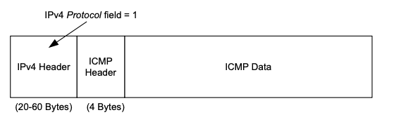
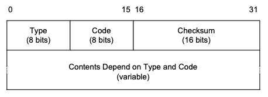
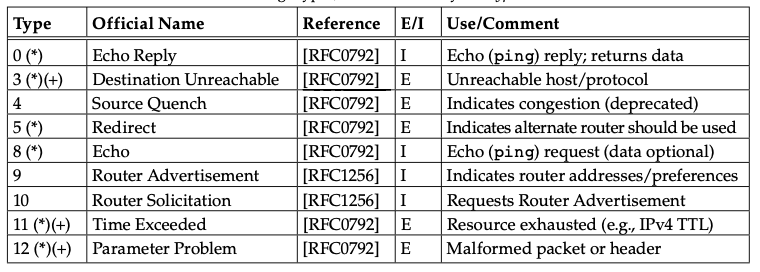

ICMP is often considered part of IP and is required for any IP implementation. It enables the provision of diagnostic information like datagram delivery errors and control information for IP configuration.

The figure below shows ICMP encapsulation within IP.

When a datagram's protocol field is set to 1, it means that the datagram is transmitting ICMP data.

1. type: identifies the message type
2. code: clarifies the message meaning
3. checksum: calculate over the whole ICMP message using the same algorithm as the one used by IP to calculate its datagram's checksum.

## ICMP Messages

There are two types of ICMP messages; those that contain errors encountered in datagram delivery and those that have information
related to datagrams.

Informational messages are handled automatically by the OS and error messages are delivered to the user process that sent
the offending datagram.

#### ICMP Error Messages

An ICMP error message contains
  - A copy of the offending datagrams IP header
  - Data from the datagram's payload such that the datagram doesn't exceed 576 bytes.

Having a copy of the offending datagram lets the receiving ICMP module associate the message with a particular protocol derived from the datagram's protocol field. The associated port number is derived from the TCP/UDP header in the datagrams payload -- first 8 bytes.

An ICMP error message is never generated in response to

1. An ICMP error message
2. A datagram destined for an IPv4 multicast or broadcast address
3. A datagram sent as a link layer broadcast
4. A fragment other than the first
5. A datagram whose src address does not define a single host like zero address, loopback address and broadcast/multicast addresses.

The general recommendation for reducing ICMP traffic is to use a token bucket for rate limiting.

