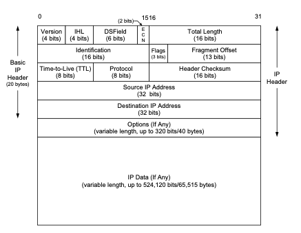
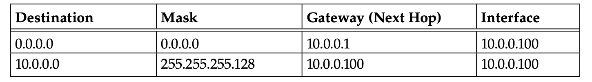

The internet protocol provides for transmitting blocks of data called datagrams from one host to another identified by fixed length addresses. It doesn't provide any guarantees that the datagrams will reach the destination host and since it lacks any sequencing logic, the datagrams may reach the destination out of order.

#### Interfacing

The protocol interfaces host to host protocols like TCP/UDP and LAN protocls like ARP. A TCP module provides a TCP segment as the data portion of the datagram and other information like the destination address. IP then creates a datagram and calls on the local network to transmit it.

                 +------+ +-----+ +-----+     +-----+
                 |Telnet| | FTP | | TFTP| ... | ... |
                 +------+ +-----+ +-----+     +-----+
                       |   |         |           |
                      +-----+     +-----+     +-----+
                      | TCP |     | UDP | ... | ... |
                      +-----+     +-----+     +-----+
                         |           |           |
                      +--------------------------+----+
                      |    Internet Protocol & ICMP   |
                      +--------------------------+----+
                                     |
                        +---------------------------+
                        |   Local Network Protocol  |
                        +---------------------------+

#### IP Datagram

The IP header is of variable size limited to 60 bytes. In most cases the header will be 20 bytes long but when options
are added -- which is rare -- the IP header could grow in size to 60 bytes. Most of the second 32-bit word is used
for the fragmentation function. The header checksum is used to validate that the IP header has been transmitted correctly.
The source and destination addresses are 32-bit words.

**IP Header Fields**
1. version: the IP version, has the value 4 for IPv4 datagrams.
2. ihl: internet header length: describes the header size, has the value 5 when no options are present.
3. dsfield: differentiated service field
4. ecn: explicit congestion notification, together with dsfield used for processing the datagram when it is forwarded.
5. total length: holds the length of the datagram in bytes. Can be used together with ihl field to calculate where the data section starts.
6. identification: helps identify each datagram sent by an IPv4 host and is important for implementing fragmentation.
7. ttl: sets an upper limit on the number of router a datagram can go through.It is initialized to some value -- normally 64 -- and
decremented by 1 by every router that processes the datagram. The router is dropped when the value gets to 0.
8. protocol: describes the type of data in the datagram's payload, most common values are 17 for UDP and 6 for TCP.
9. checksum: calculated over the ip header only and used to ensure correctness.
10. source ip address: the sender's address.
11. destination ip address: the target's address.

#### Checksum

#### DSField And ECN

Differentiated services field (DSField) is a framework and set of standards for providing different class of services like datagram priority during transmission.

The pair of ECN bits are used to mark a datagram with congestion indicator when passing through a router with significant internal queue. The use case is that when a marked packet is received some protocol like tcp can communicate backe to the sender which will slow down and ease congestion.

#### IP Options

I am going to essentially skip covering IP Options since they are no longer in wide use.

## IP Forwarding

If a the src and dst of a datagram are in the same network the datagram is sent directly without routing.A router is not required or used. Otherwise the host sends the datagram to a single router and lets the router deliver the datagram to its destination.

The essential difference between a host and router is that a host never forwards a datagram it didn't generate but a router does. Most hosts today can be configured to be routers as well.

When a host receives a datagram and the destination IP is one of its IP addresses (associated with its network interfaces) or a broadcast/multicast address the datagram is delivered to the protocol module (tcp/udp) depending on the protocol field.

But if the datagram dst IP is different, two things may happen
   1. The datagram gets discarded silently
   2. If the host is also configured to work as a router, the IP layer will maintain a forwarding/routing table in which it searches before forwarding the datagram. If no route is known, an ICMP message is sent back indicating the error.

#### Forwarding Table

Each entry in the forwarding table contains the following information.

1. Destination: 32-bit field containing the result of a masking operation. The value can be 0 for default route (all destinations) or a full 32-bit IP address denoting a single destination.

2. Mask: A 32-bit value that is bitwise ANDed to the Destination IP of a datagram being looked up in the forwarding table. The result is compared with entries in the forwarding table.

3. Next-Hop: Contains the address of the next router or host the datagram should be transmitted to. The next-hop entity is usually on the same network as the system performing the forwarding table look up.

4. Interface: Contains an identifier used by the IP layer to reference the network interface that will be used to send the datagram to its next hop.

#### Direct Delivery Forwarding

Assuming we have the routing table below and a datagram with the destination IP `10.0.0.9`. And now we have to decide which entry between the two do we use to forward the datagram, that's where the longest prefix algorithm comes into the picture.

**Longest Prefix Algorithm**

For each entry we AND the datagram destination IP and the routing table's mask field

1. 10.0.0.9 AND 0.0.0.0 = 0.0.0.0
2. 10.0.0.9 AND 255.255.255.128  this is the same as

00001010.00000000.00000000.00001001 `AND` 11111111.11111111.11111111.10000000 `=` 00001010.00000000.00000000.00000000

Which when converted to decimal is 10.0.0.0 and matches the destination field of the second entry in the forwarding table. So we'll pick `10.0.0.100` as the datagram's next-hop IP address.

#### In-direct Delivery Forwarding

